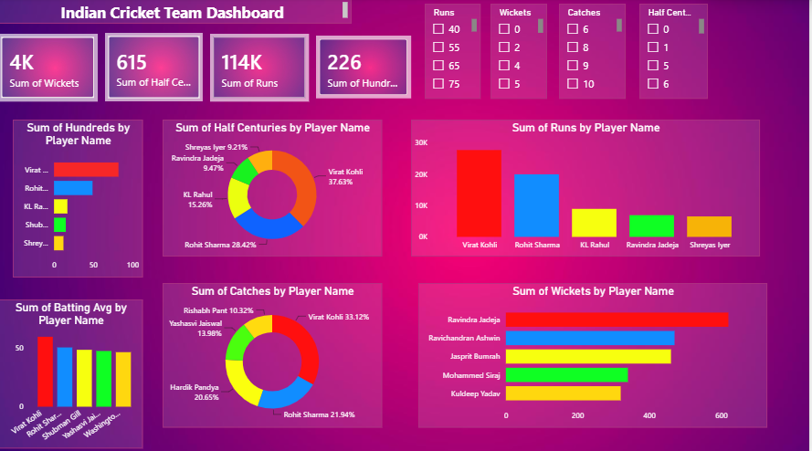

# Indian-Cricket-Team-Analysis-Dashboard
## 1. Project Title
*Indian Cricket Team Performance Analysis Dashboard*

## 2. Project Objective
The objective of this project is to analyze the historical performance of the Indian Cricket Team. By aggregating and transforming raw match data, this dashboard aims to evaluate individual player consistency, identify primary match-winners, and track key performance milestones. Ultimately, these data-driven insights serve to highlight team strengths and pinpoint structural pillars of the team's success.

## 3. Key Performance Indicators (KPIs) Tracked
The dashboard evaluates both batting and bowling excellence by tracking the following primary individual milestones:

### 🏏 Batting Performance Metrics
* *Top 5 Century Scorers:* Tracks player scoring consistency and their ability to convert starts into match-defining hundreds.
* *Top 5 Half-Century Scorers:* Measures player consistency across innings.
* *Highest Batting Averages:* Tracks scoring reliability and stability among the top order.

### 🥎 Bowling & Fielding Metrics
* *Leading Wicket Takers:* Highlights the primary strike force and breakthrough bowlers for the team.
* *Top 5 Safe Hands:* Tracks catches to evaluate outfield fielding efficiency and defensive impact.

## 4. Key Insights & Data Storytelling
By analyzing the dashboard's core metrics, several critical insights emerge regarding the backbone of the Indian Cricket Team's success:

* *The Run Machine Supremacy:* *Virat Kohli* single-handedly accounts for over *37.63%* of the team's half-centuries among the top players and completely dominates the absolute volume of total runs, followed closely by *Rohit Sharma* at *28.42%*.
* *The Bowling Engine:* *Ravindra Jadeja* holds a commanding lead in the total wickets bar chart, establishing himself alongside Ravichandran Ashwin as a primary strike force.
* *Complete Athletic Value:* In the catches distribution pie chart, *Virat Kohli (30.12%)* and *Rohit Sharma (21.94%)* aren't just leading with the bat; they actively control over half of the team's top outfield catches, proving their comprehensive athletic value to the squad.

## 5. Conclusion
This dashboard successfully transitions raw cricket statistics into a strategic performance tool. By highlighting the core contributions of senior players like Kohli, Sharma, and Jadeja, the analysis provides a clear picture of India's match-winning formula. The project demonstrates the power of using Power BI to turn historical records into clean, actionable sports analytics.
